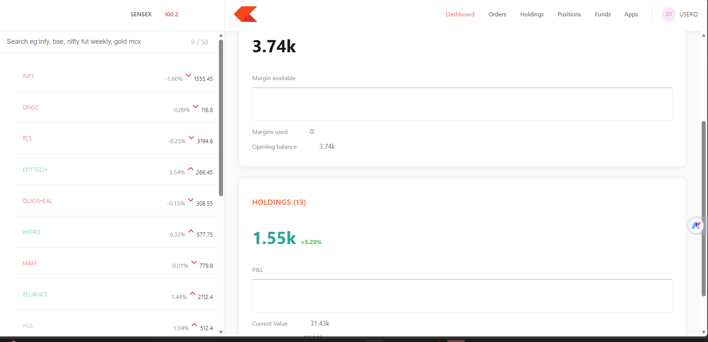

# Zerodha Clone (MERN Stack)

A full-stack trading dashboard clone inspired by [Zerodha Kite](https://kite.zerodha.com/), built with the MERN stack (MongoDB, Express, React, Node.js). This project replicates the core UI/UX of a modern trading platform, including a live watchlist, holdings, positions, orders, and funds pages — with a custom-designed interface built on top of the original layout.



## Features

- **Dashboard** — Portfolio summary with equity margin and holdings overview, styled as clean, elevated cards
- **Watchlist** — Scrollable stock list with live price/percentage display, hover highlights, and quick Buy/Sell actions
- **Holdings** — Table view of owned stocks with P&L, current value, and a visual bar chart
- **Positions** — Open positions with real-time profit/loss coloring, using the same styled table as Holdings
- **Orders** — Empty-state and order history view
- **Funds** — Account margin, balance, and commodity account details, redesigned as stat cards
- **Apps** — Placeholder page for future app integrations

## Design

The original functional layout has been restyled with a modern, card-based visual language:

- **Typography** — [Inter](https://fonts.google.com/specimen/Inter), loaded via Google Fonts, replacing the default system font stack
- **Cards** — Rounded corners, subtle box-shadows, and hover lift effects on all major sections (Summary, Holdings table, Funds panels, Orders empty-state)
- **Color scheme** — Teal (`#26a69a`) for profit/gains, red (`#ef5350`) for loss, orange (`#ff5722`) as the accent/brand color
- **Tables** — Sticky-style headers, row hover highlighting, and bold profit/loss coloring for quick scanning
- **Sidebar/watchlist** — Cleaner spacing, subtle row hover states, and consistent up/down coloring

All styling changes live in `dashboard/src/index.css` — no changes were made to component logic or data flow.

## Tech Stack

**Frontend**
- React 18
- React Router DOM
- Material UI (MUI) + MUI Icons
- Chart.js / react-chartjs-2
- Axios
- Google Fonts (Inter)

**Backend**
- Node.js
- Express
- MongoDB with Mongoose
- dotenv, cors, body-parser

## Project Structure

```
Zerodha-main/
├── backend/          # Express API server + MongoDB models
│   ├── model/
│   ├── schemas/
│   ├── index.js
│   └── .env
├── dashboard/         # Main React trading dashboard (MUI-based)
│   ├── src/
│   │   ├── components/
│   │   ├── index.css   # All custom styling lives here
│   │   └── index.js
└── frontend/          # Secondary React app (landing/auth)
    └── src/
```

## Getting Started

### Prerequisites

- [Node.js](https://nodejs.org/) (v16 or higher)
- [MongoDB](https://www.mongodb.com/try/download/community) (running locally, or a MongoDB Atlas cluster)

### 1. Clone the repository

```bash
git clone https://github.com/sanikas97/Stock-trading-platform.git
cd Stock-trading-platform
```

### 2. Set up the backend

```bash
cd backend
npm install
```

Create a `.env` file in the `backend` folder (this file is intentionally excluded from the repo via `.gitignore`):

```
MONGO_URL=mongodb://127.0.0.1:27017/zerodha
```

(Replace with your MongoDB Atlas connection string if using the cloud instead of a local database.)

Start the backend server:

```bash
npm start
```

The server runs on `http://localhost:3002` by default. You should see:
```
App started!
DB started!
```

### 3. Seed sample data (first-time only)

With the backend running, visit these URLs once in your browser to populate sample holdings and positions:

```
http://localhost:3002/addHoldings
http://localhost:3002/addPositions
```

Data persists in MongoDB after this — you only need to do it once, or again if the database is cleared.

### 4. Set up the dashboard (frontend)

In a new terminal:

```bash
cd dashboard
npm install
npm start
```

This opens the dashboard automatically at `http://localhost:3000`.

## Environment Variables

| Variable    | Description                          | Example                                |
|-------------|---------------------------------------|-----------------------------------------|
| `MONGO_URL` | MongoDB connection string             | `mongodb://127.0.0.1:27017/zerodha`     |
| `PORT`      | Backend server port (optional)        | `3002`                                  |

## API Endpoints

| Method | Endpoint         | Description                     |
|--------|------------------|----------------------------------|
| GET    | `/allHoldings`   | Fetch all holdings              |
| GET    | `/allPositions`  | Fetch all positions             |
| POST   | `/newOrder`      | Save a new buy/sell order       |
| GET    | `/addHoldings`   | Seed sample holdings (dev only) |
| GET    | `/addPositions`  | Seed sample positions (dev only)|

## Notes

- This is an educational clone built for learning full-stack development — it does not connect to real market data or a live brokerage.
- NIFTY 50 / SENSEX index values shown in the top bar are static placeholders.
- Positions data is currently sourced from a static local file rather than the database.
- Orders placed via the UI are saved to MongoDB via `POST /newOrder`, but the Orders page does not yet fetch and display them — this is a good next feature to build.

## License

This project is for educational purposes only.

